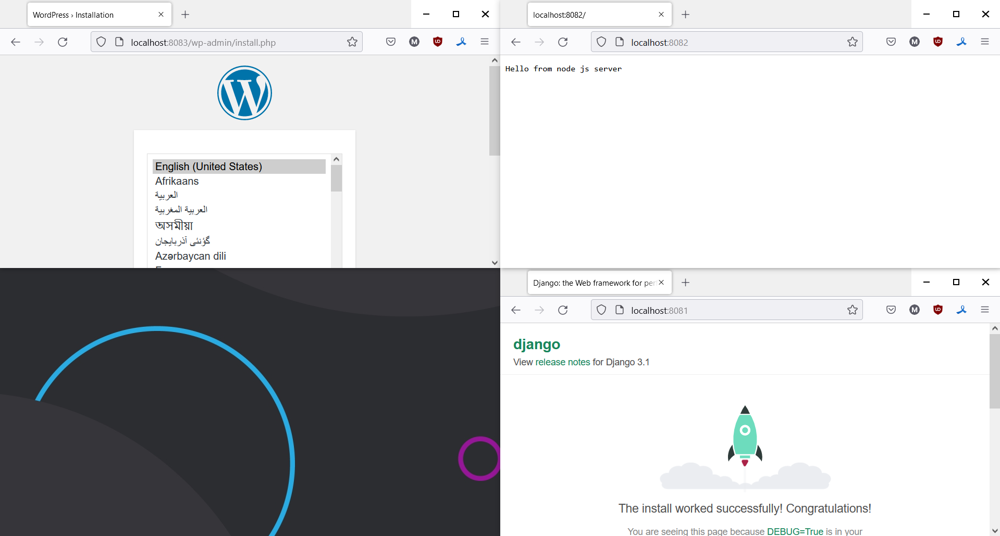

<h2>стенд nginx + php-fpm (wordpress) + python (django) + js(node.js) с деплоем через docker-compose</h2>

сетевой драйвер между контейнерами: bridge 
использованы образы:
- nginx в качестве прокси
- mysql для работы wordpress
- wordpress
- django образ, собранный на основе образа python
- node

</img>